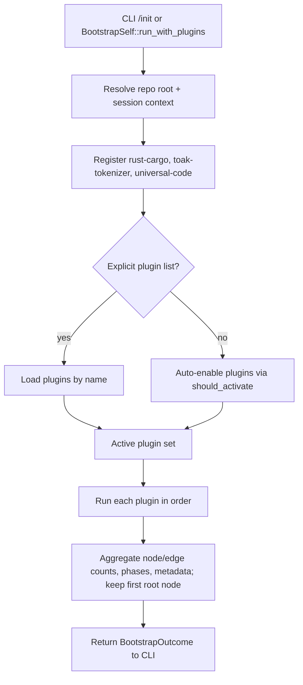
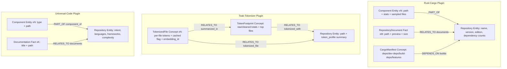
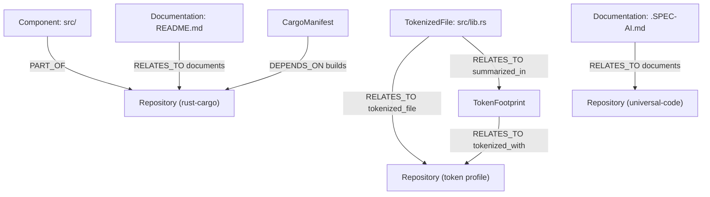

# Bootstrap Self Process

This document maps the current bootstrap-self flow and plugins in `spec-ai`.

## Upcoming Changes (design staged)

- Add `/refresh` to rerun bootstrap with caching, distinct from first-use `/init`.
- Persist per-file token stats and embeddings in DuckDB for reuse across sessions.
- Reuse cached tokenization when file hashes match; only re-tokenize changed files.
- Link per-file embeddings into the graph so downstream agents can query them immediately.
- Keep existing defaults (rust-cargo, toak-tokenizer, universal-code) but allow explicit plugin selection.

## Pipeline Control Flow

## Plugin Responsibilities and Graph Writes

## Example Graph (Simple Repository)

## Plugin Behavior Details

- `rust-cargo`
  - Activates when `Cargo.toml` exists.
  - Phases: survey layout, index docs/specs, extract Cargo manifest, link graph.
  - Limits: components capped at 12, documents at 8; samples up to 5 files per component.
  - Outputs: repository node plus component, document, and manifest nodes with typed edges.

- `toak-tokenizer`
  - Activates when a `.git` directory exists.
  - Phases: discover tracked files (via `git ls-files` fallback to walk), clean/redact (`toak_rs::clean_and_redact`), count tokens (`count_tokens`), hash + cache per-file stats, build hashed embeddings, summarize.
  - Limits: max 200 files, 200KB per file, ignores common binary extensions and build/temp dirs; keeps top 8 files by cleaned token count.
  - Outputs: repository node with token profile, `TokenFootprint` concept, and per-file `TokenizedFile` nodes (with cached flag, token counts, bytes, embedding_id) linked back to the repo and footprint. Persists per-file stats and embeddings in DuckDB for cache-aware refreshes.

- `/refresh`
  - Re-runs bootstrap with caching enabled so tokenized files and embeddings reuse DuckDB data when unchanged.

- `universal-code`
  - Activates when a VCS marker, code files, or common manifests are present.
  - Phases: classify files, intent analysis, semantic analysis, build knowledge graph.
  - Limits: scans up to 1000 files, caps components at 15 and documents at 8; ignores common build/cache directories.
  - Outputs: repository node plus component/document nodes and writes a `.SPEC-AI.md` summary to the repo root. If tokenized file cache exists, adds per-repo and per-component token profiles sourced from DuckDB without re-tokenizing.

## Data Aggregation Notes

- `BootstrapSelf` keeps the first plugin’s `root_node_id` as the repository identifier in the final `BootstrapOutcome`, but each plugin writes its own repository node to the graph.
- Node/edge counts in the outcome are totals across all plugins; phases are concatenated in plugin execution order.
