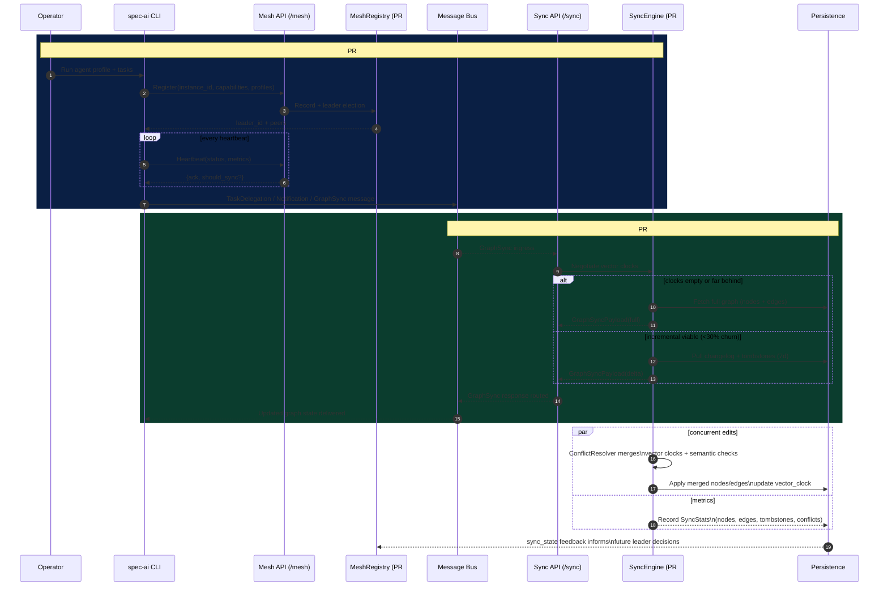

# Mesh + Graph Sync 
## An Odyssey 
### (PR #15 & #16)

```mermaid
sequenceDiagram
    autonumber
    participant Operator
    participant CLI as spec-ai CLI
    participant MeshAPI as Mesh API (/mesh)
    participant Registry as MeshRegistry (PR #15)
    participant Bus as Message Bus
    participant SyncAPI as Sync API (/sync)
    participant Engine as SyncEngine (PR #16)
    participant Store as Persistence

    rect rgb(10,31,68)
        note over Operator,Engine: PR #15 – Service Mesh ignition
        Operator->>CLI: Run agent profile + tasks
        CLI->>MeshAPI: Register(instance_id, capabilities, profiles)
        MeshAPI->>Registry: Record + leader election
        Registry-->>CLI: leader_id + peers
        loop every heartbeat
            CLI->>MeshAPI: Heartbeat(status, metrics)
            MeshAPI-->>CLI: {ack, should_sync?}
        end
        CLI->>Bus: TaskDelegation / Notification / GraphSync message
    end

    rect rgb(11,61,46)
        note over Bus,Store: PR #16 – Knowledge Graph synchronization
        Bus-->>SyncAPI: GraphSync ingress
        SyncAPI->>Engine: Negotiate vector clocks
        alt clocks empty or far behind
            Engine->>Store: Fetch full graph (nodes + edges)
            Engine-->>SyncAPI: GraphSyncPayload(full)
        else incremental viable (<30% churn)
            Engine->>Store: Pull changelog + tombstones (7d)
            Engine-->>SyncAPI: GraphSyncPayload(delta)
        end
        SyncAPI-->>Bus: GraphSync response routed
        Bus-->>CLI: Updated graph state delivered
    end

    par concurrent edits
        Engine->>Engine: ConflictResolver merges\nvector clocks + semantic checks
        Engine->>Store: Apply merged nodes/edges\nupdate vector_clock
    and metrics
        Engine-->>Store: Record SyncStats\n(nodes, edges, tombstones, conflicts)
    end

    Store-->>Registry: sync_state feedback informs\nfuture leader decisions
```

